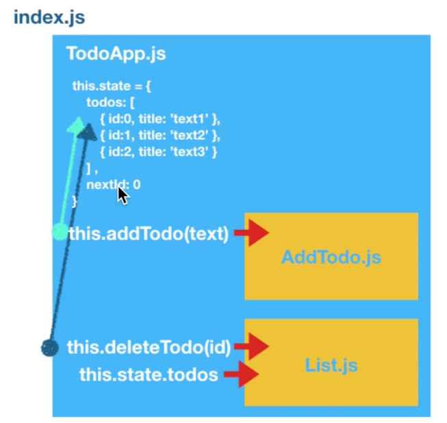

<a id = "contents">

# Contents

* [All Textbook](https://nakanisi-yusuke.gitbooks.io/react-basic-udemy/content/)
* [React](#react)
* [Todo App](#todo)
* [Asynchronous Http transaction](#async)
* [Giphy API](#giphy)
* [Redux](#redux)

## Free Json data
* [Json Placeholder](https://jsonplaceholder.typicode.com/)

<a id = "react">

## How to edit Allow Functions
* Please check below.
  * src/react02/src/index.js

## How to edit React Element
* Please check below.
  * src/react03/src/index.js
  * src/react04/src/index.js

## How to edit Export Default
* Please check below.
  * src/react06/src/index.js

## How to edit class
* Please check below.
  * src/react08/src/index.js

## How to edit React Class Component and Click Event (Set State)
* Please check below.
  * src/react09/src/index.js

## How to edit map
* Please check below.
  * src/map01/src/index.js
  * src/map_filter01/src/index.js

## How to edit filter
* Please check below.
  * src/filter01/src/index.js
  * src/map_filter01/src/index.js

### [Return to Contents](#contents)

<a id = "todo">

## Construct ToDo App
* Please check below.
  * src/todoapp01/src/
  

### [Return to Contents](#contents)

<a id = "async">

## Asynchronous Http transaction
* Please check below.
  * src/axois0X/src/
  * Asynchronous.md

### [Return to Contents](#contents)

<a id = "giphy">

## Giphy API Key
* Please check below.
  * src/axois0X/src/

### [Return to Contents](#contents)

<a id = "redux">

## Redux
* Please check below.
  * src/axois0X/src/

### [Return to Contents](#contents)

